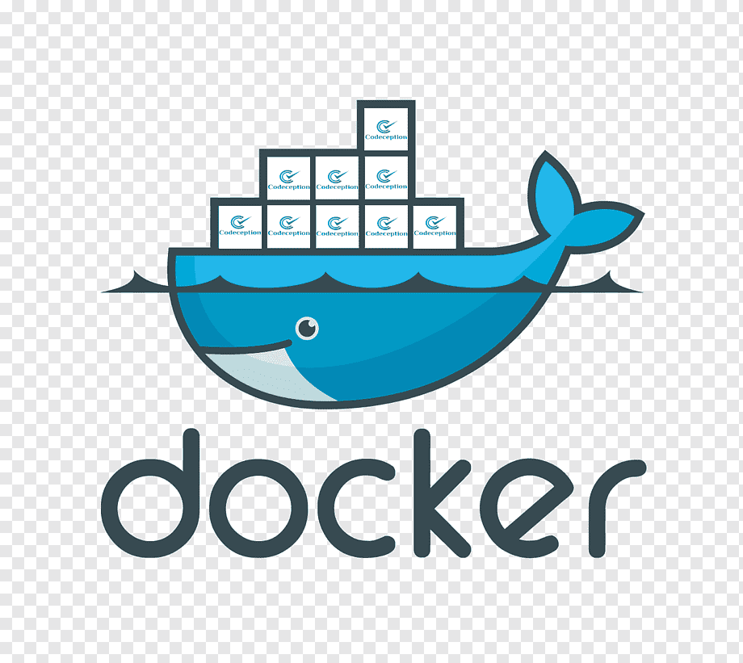

[Canal do Youtube Airton Teshima - Docker compose na Prática (Fácil)](https://www.youtube.com/watch?v=HxPz3eLnXZk)

[Link para a documentação oficial do mysql no docker hub](https://hub.docker.com/_/mysql)

1. O que é Docker?

> O Docker é um software de código aberto usado para implantar aplicativos dentro de containers virtuais. A conteinerização permite que vários aplicativos funcionem em diferentes ambientes complexos. Por exemplo: o Docker permite executar o WordPress em sistemas Windows, Linux e macOS, sem problemas.

### Script subindo um container mysql e mapaenado volume e portas:

```yml
# Subindo um container Mysql com Docker Compose
# CanalYoutube:https://www.youtube.com/watch?v=HxPz3eLnXZk
# LinkDocker-Hub Image mysql: https://hub.docker.com/_/mysql

version: '3.1'

services:
    db:
        # nomeando o container docker
        container_name: sisreadxls-mysql
        # baixando a imagem no docker-hub caso não exista na maquina hospedeira
        image: mysql:5.7.31
        # Esse comando séra executado assim que esse container estiver UP essa linha é recomendada
        # na documentação do docker-hub conforme explicitado no cabeçalho desse arquivo. Nada mais 
        # é que o plugin de autenticação que iremos utilizar com mysql. No mysql 8 a forma de 
        # autenticação mudou e alguns drives ainda não dão suporte 
        command: --default-authentication-plugin=mysql_native_password
        environment:
            MYSQL_ROOT_PASSWORD: root
        volumes:
          - ./dbreadxls:/var/lib/mysql
        # Caso aconteça algum problema com o container e pare o container será 
        # reiniciado automaticamente
        restart: always
        ports: 
            - '3308:3306'

```

### Comando para executar o docker-compose linux:

> Dentro da pasta onde encontra-se seu arquivo docker-compose.yml executeo comando abaixo explicitado.

```bash
docker-compose up -d
```
